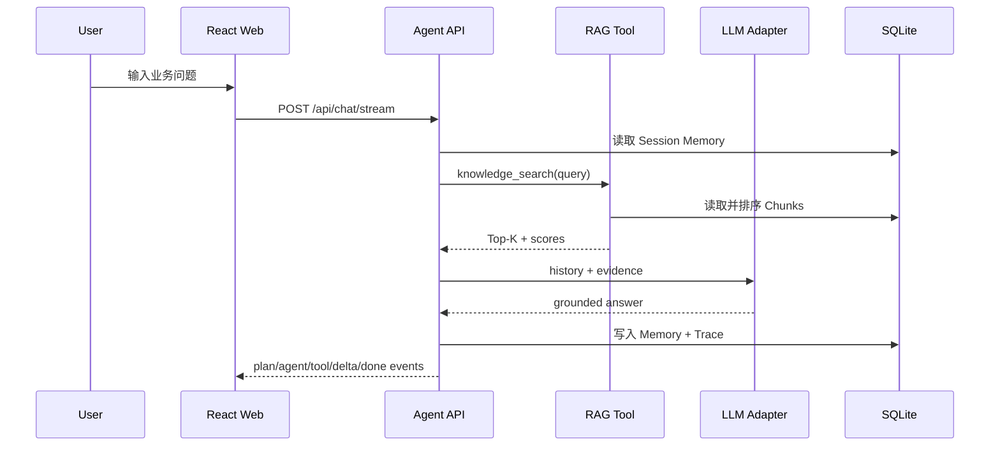
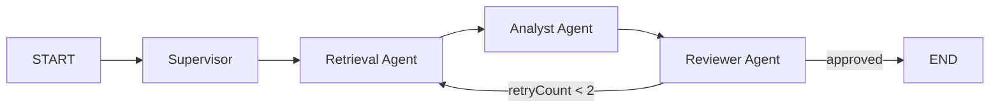

# Architecture Decision Record

## 为什么选择轻量单体而不是直接拆微服务

作品集需要低门槛运行，同时展现清晰的领域边界。当前以模块化单体承载 API、Agent、RAG 和数据访问，模块间仅通过明确接口通信；当吞吐或团队规模增长时，可沿以下边界拆分：

- `document-service`：文件解析、切片与索引任务生产。
- `retrieval-service`：关键词/向量检索、重排与权限过滤。
- `agent-runtime`：状态机、工具注册、记忆与模型路由。
- `evaluation-service`：离线数据集、在线反馈、质量回归。

## 核心请求序列

## LangGraph 多 Agent 状态图

共享状态包含 `query`、`history`、`citations`、`draft`、`review`、`route` 和 `retryCount`。每个角色是独立 LangGraph 节点；Reviewer 使用条件边控制结束或补充检索，最大两轮以限制延迟和模型成本。

## 关键权衡

- 默认 Demo 模型确保项目可离线演示；适配器支持以配置切换真实模型。
- 当前检索算法无需外部服务且可解释；生产环境应替换成向量检索与 Reranker。
- SQLite WAL 适合可靠的单机交付；服务横向扩展时迁移 PostgreSQL，并用 Redis 保存短期记忆和缓存。
- Agent 使用受控的 LangGraph 状态图平衡质量、延迟与成本；后续可加入持久化 Checkpoint、Human-in-the-loop 和更细粒度的模型 Reviewer。
